# Payment & Reserve Flow Diagram

```mermaid
flowchart TD
    Start([User wants to pay]) --> CreateIntent[API: POST /api/payments/address]
    CreateIntent --> AllocateIndex[Allocate derivation index from DB sequence]
    AllocateIndex --> DeriveAddress[Derive deposit address from xpub]
    DeriveAddress --> SavePending[Save payment record: status=pending]
    SavePending --> ReturnAddress[Return paymentId + depositAddress to user]
    ReturnAddress --> UserPays[User sends USDT to depositAddress]
    
    UserPays --> WorkerStart[Worker: processPaymentsPipeline runs every 30s]
    
    WorkerStart --> Scan[1. SCAN: scanPaymentIntents]
    Scan --> GetPending[Get all pending payments from DB]
    GetPending --> GetCursor[Get last scanned block from cursor]
    GetCursor --> QueryRPC[Query BSC RPC for Transfer events]
    QueryRPC --> FilterEvents[Filter events matching deposit addresses]
    FilterEvents --> CheckAmount{Amount >= minimum?}
    CheckAmount -->|No| SkipPayment[Skip payment]
    CheckAmount -->|Yes| ConfirmPayment[Update payment: status=confirmed]
    ConfirmPayment --> UpdateCursor[Update cursor to last scanned block]
    UpdateCursor --> ScanDone[Scan complete]
    
    ScanDone --> Sweep[2. SWEEP: sweepConfirmedPayments]
    Sweep --> GetConfirmed[Get confirmed payments with sweepStatus=pending/failed]
    GetConfirmed --> CheckRetry{Retry count < 3?}
    CheckRetry -->|No| MarkExhausted[Mark as exhausted]
    CheckRetry -->|Yes| MarkAttempt[Mark sweepStatus=funding]
    MarkAttempt --> CallReserve[Call Reserve Service: POST /sweep]
    
    CallReserve --> ReserveAuth[Reserve: Validate API key]
    ReserveAuth --> ReserveValidate[Reserve: Validate request body]
    ReserveValidate --> DerivePrivateKey[Reserve: Derive private key from xprv]
    DerivePrivateKey --> VerifyAddress{Derived address matches?}
    VerifyAddress -->|No| ReserveError[Return error: ADDRESS_MISMATCH]
    VerifyAddress -->|Yes| CheckBalance[Check USDT balance on deposit address]
    CheckBalance --> CheckMinBalance{Balance >= minUsdtUnits?}
    CheckMinBalance -->|No| ReserveError2[Return error: INSUFFICIENT_BALANCE]
    CheckMinBalance -->|Yes| DeriveGasWallet[Derive gas wallet from xprv index 0]
    DeriveGasWallet --> CheckGasBalance{Has enough BNB for gas?}
    CheckGasBalance -->|No| FundGas[Send BNB from gas wallet]
    FundGas --> WaitFund[Wait for funding confirmation]
    WaitFund --> TransferTokens
    CheckGasBalance -->|Yes| TransferTokens[Transfer all USDT to treasury]
    TransferTokens --> WaitSweep[Wait for sweep confirmation]
    WaitSweep --> ReturnSweepResult[Return sweepTxHash + fundingTxHash]
    
    ReturnSweepResult --> UpdateSwept[Update payment: sweepStatus=swept]
    UpdateSwept --> SweepDone[Sweep complete]
    
    SweepDone --> Apply[3. APPLY: applySweptPayments]
    Apply --> GetSwept[Get payments with sweepStatus=swept]
    GetSwept --> StartTx[Start DB transaction]
    StartTx --> CheckApplied{Already applied?}
    CheckApplied -->|Yes| SkipApply[Skip - already applied]
    CheckApplied -->|No| ActivateMembership[Activate user membership tier]
    ActivateMembership --> MarkApplied[Mark payment: appliedAt=now]
    MarkApplied --> CommitTx[Commit transaction]
    CommitTx --> ApplyDone[Apply complete]
    
    SkipPayment --> ScanDone
    MarkExhausted --> SweepDone
    ReserveError --> MarkFailed[Mark sweepStatus=failed, increment retry]
    ReserveError2 --> MarkFailed
    MarkFailed --> ScheduleRetry[Set sweepRetryAfter with backoff]
    ScheduleRetry --> SweepDone
    SkipApply --> ApplyDone
    
    ApplyDone --> End([Payment complete - User has membership])
    
    style Start fill:#e1f5ff
    style End fill:#c8e6c9
    style UserPays fill:#fff9c4
    style Scan fill:#e3f2fd
    style Sweep fill:#f3e5f5
    style Apply fill:#e8f5e9
    style ReserveAuth fill:#ffebee
    style ReserveError fill:#ffcdd2
    style ReserveError2 fill:#ffcdd2
    style MarkFailed fill:#ffcdd2
```

## Detailed Flow Steps

### 1. Payment Intent Creation (API Server)
- User requests payment via `POST /api/payments/address`
- System allocates unique `derivationIndex` from DB sequence
- Derives deposit address from `xpub` using derivation index
- Saves payment record with status `pending`
- Returns `paymentId` and `depositAddress` to user

### 2. User Payment
- User sends USDT tokens to the `depositAddress`
- Transaction is broadcast to BSC network

### 3. Scanning Phase (Worker - every 30s)
- Worker runs `scanPaymentIntents()`
- Queries BSC RPC for Transfer events in recent blocks
- Filters events matching pending payment deposit addresses
- Validates amount meets minimum requirement
- Updates payment status to `confirmed` when found
- Updates cursor to track scanning progress

### 4. Sweeping Phase (Worker)
- Worker runs `sweepConfirmedPayments()`
- Finds confirmed payments with `sweepStatus=pending` or `failed`
- Checks retry count (max 3 attempts)
- Calls Reserve Service `/sweep` endpoint with:
  - `paymentId`
  - `derivationIndex`
  - `fromAddress` (deposit address)
  - `minUsdtUnits`

### 5. Reserve Service Processing
- Validates API key authentication
- Validates request parameters
- Derives private key from `xprv` using `derivationIndex`
- Verifies derived address matches expected address
- Checks USDT balance on deposit address
- Derives gas wallet from `xprv` at index 0
- Ensures gas wallet has BNB (funds if needed)
- Transfers all USDT from deposit address to treasury
- Waits for transaction confirmations
- Returns sweep transaction hash

### 6. Application Phase (Worker)
- Worker runs `applySweptPayments()`
- Finds payments with `sweepStatus=swept` and no `appliedAt`
- Starts database transaction
- Activates user's membership tier
- Marks payment as applied
- Commits transaction

## Error Handling & Retries

- **Failed sweeps**: Marked as `failed`, retry count incremented
- **Retry scheduling**: Exponential backoff (5s, 10s, 20s, max 1 hour)
- **Max retries**: After 3 failed attempts, marked as `exhausted`
- **Database failures**: Retry logic for DB updates after successful sweep
- **RPC failures**: Logged and cursor not updated (prevents skipping blocks)

## Key Components

- **Payment Service**: Handles payment intents, scanning, coordination
- **Reserve Service**: Handles secure key management and token sweeping
- **Worker**: Background job processor running payment pipeline
- **Database**: Tracks payment status, retries, and scanning progress
